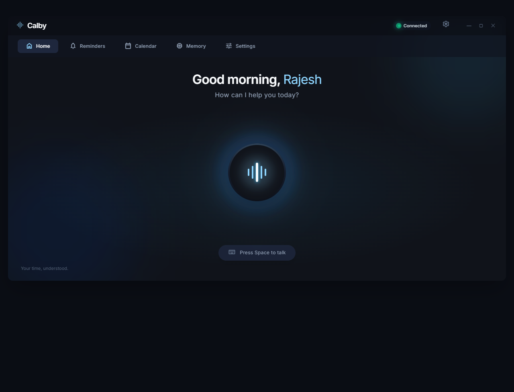
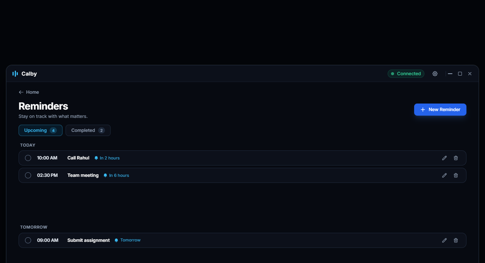
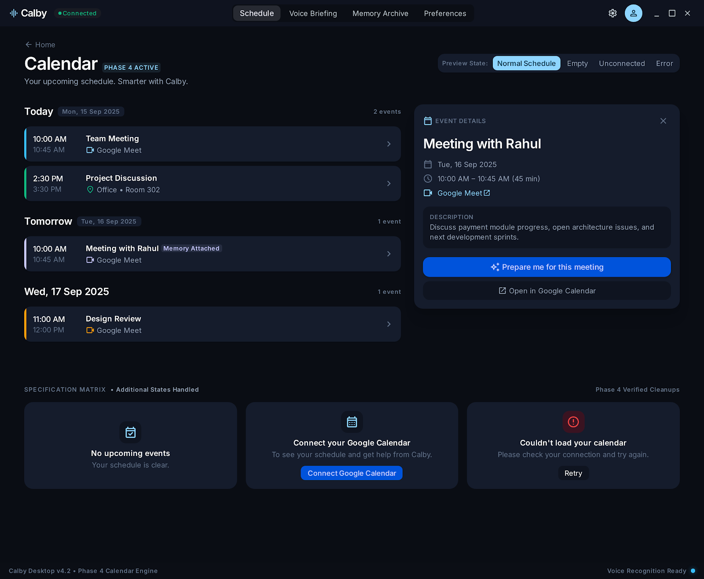
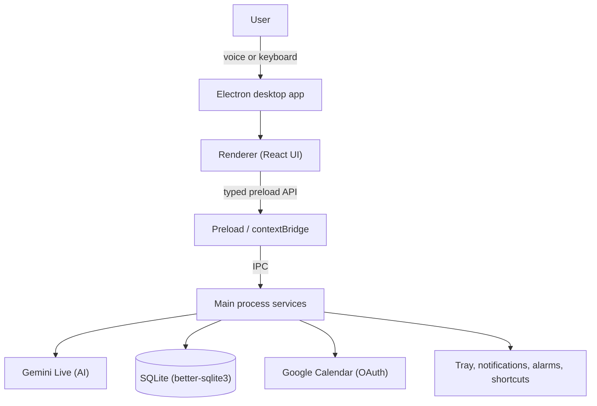

<div align="center">


# Calby

### Your personal desktop assistant.

Talk to Calby about your day. It keeps your calendar, reminders, and personal memory in one place,
listens while you work, and quietly takes care of the small things you would otherwise do by hand.

[](https://github.com/rajesh-kayal-dev/calby-desktop/releases)
[](#supported-platforms)
[](https://github.com/rajesh-kayal-dev/calby-desktop/actions/workflows/desktop-packages.yml)
[](LICENSE)

**[Download](#download)** · **[GitHub Releases](https://github.com/rajesh-kayal-dev/calby-desktop/releases)** · **[Documentation](docs/)** · **[Quick start](#quick-start)**

<!-- TODO: add the public website link here once the Calby website is deployed (source lives in calby-website/). -->

</div>

**Contents:** [What is Calby](#what-is-calby) · [Features](#core-features) · [Quick Voice](#quick-voice) · [How it works](#how-it-works) · [Tech stack](#tech-stack) · [Platforms](#supported-platforms) · [Download](#download) · [Quick start](#quick-start) · [Development](#development) · [Releases](#releases) · [Roadmap](#roadmap)

---

## See Calby in action

> **TODO — screenshots:** no screenshots of the running app are checked in yet. Replace the design previews below with real captures of the main window, the Quick Voice window, and a calendar/reminder workflow.

<!-- TODO: add real screenshots (e.g. docs/screenshots/main-window.png, quick-voice.png, calendar-reminder.png) and swap the three images below. -->

The images below are design previews from [`design/`](design/). They show the intended interface, not the running app.

| Main window | Reminders | Calendar |
| :---: | :---: | :---: |
|  |  |  |

---

## What is Calby?

Calby is a small desktop app that you talk to. Ask it to add a meeting, remind you tomorrow morning, or remember something about a person, and it does the thing on your device instead of just replying with text.

It runs in the background next to your clock, opens with a keyboard shortcut, and keeps your data — reminders, memories, settings — stored locally.

**Status:** v1.0.0 released, in active development.

---

## Core features

| Feature | What it does |
| --- | --- |
| **Natural language actions** | “Remind me Friday at 9”, “move my meeting to 4pm” — Calby turns speech into real actions on reminders, calendar events, and memory, then reports the actual result of each one. |
| **Reminders** | Local scheduling, desktop notifications with snooze and dismiss, alarm sounds, catch-up for reminders missed while the app was closed, and OS wake scheduling so reminders still fire after sleep. |
| **Personal memory** | Save, search, edit, and delete facts about your life. Stored in SQLite on your device and can be switched off from privacy settings. |
| **Voice interaction** | Live Gemini voice session with push-to-talk (Space), listening / thinking / responding states, barge-in interruption, and spoken answers. |
| **Quick Voice** | A compact always-on-top voice window opened from anywhere with a global shortcut. See [Quick Voice](#quick-voice). |
| **Background & tray** | Tray menu with Open, Settings & Privacy, Quick Voice, and Quit. Calby keeps running in the background, and notification clicks bring it back to the foreground. |
| **Google integrations** | Optional Google Calendar through Google's desktop OAuth flow: upcoming events, create / update / delete events, and Google Meet links on supported event flows. |
| **Notifications** | Native OS notifications with actions, plus bundled notification and alarm sound packs you can pick in Settings. |
| **Settings** | Gemini key, voice and microphone, reminder sounds, calendar, memory & privacy, and personalization (your name) — persisted locally. |

---

## Quick Voice

Quick Voice is for when you need Calby for ten seconds and do not want to open the full app.

- **Global shortcut** — `Ctrl+Shift+C` (`Cmd+Shift+C` on macOS) out of the box, changeable in Settings. It deliberately never takes over the `Ctrl/Cmd+Shift+Space` “activate Calby” shortcut, and if the new combination is unavailable the previous one is restored instead of silently disappearing.
- **Floating compact UI** — a small frameless window that is always on top, stays out of the taskbar, and anchors to the top-right of the screen with a draggable header, a status line, and a session timer.
- **Works from the background** — launch it from the tray menu or the shortcut while Calby is minimized to the tray.
- **One session owner** — the main window and the Quick Voice window never drive the same voice session at the same time. Opening Quick Voice hands it the microphone and the live session; closing it hands ownership back to the main window, and voice events always follow the owner.
- **Friendly online/offline state** — the header shows the running timer while online and a plain “Offline” pill when the connection drops, with clear “You're offline” and “Connection lost” messages instead of raw errors.
- **Closes itself when it is done** — after an answered turn falls back to idle, the window auto-closes; clarification questions keep it open.

---

## How it works



Two rules hold the design together:

1. **Gemini understands, Calby executes.** The model decides what you meant; main-process services run the action, write the data, schedule the reminder, and confirm the result before anything is shown as success.
2. **The renderer stays unprivileged.** All windows run with `contextIsolation: true` and `nodeIntegration: false`. React talks only to the typed preload bridge — no Node APIs, no database access, no secrets in the renderer.

Full details: [Architecture](docs/architecture/ARCHITECTURE.md) · [IPC contracts](docs/architecture/IPC_CONTRACTS.md) · [Project structure](docs/architecture/PROJECT_STRUCTURE.md)

---

## Tech stack

| Area | Technologies |
| --- | --- |
| **Desktop** | Electron 29 · `@electron-toolkit/utils` · system tray, global shortcuts, native notifications |
| **Frontend** | React 18 · TypeScript 5 · Tailwind CSS 4 · lucide-react · Geist |
| **Backend (main process)** | Node.js services · Zod validation · typed IPC handlers |
| **Database** | SQLite via `better-sqlite3`, stored in the per-user app data folder |
| **AI** | Google Gemini (`@google/genai`) — live voice session and tool calls (model in `apps/desktop/src/main/services/gemini.config.ts`) |
| **Integrations** | Google Calendar API with desktop OAuth 2.0 · OS notifications, alarms, tray |
| **Build & release** | electron-vite · Vite 5 · electron-builder · npm workspaces · GitHub Actions |
| **Testing & quality** | Vitest · Playwright (end-to-end) · ESLint · Prettier |

---

## Supported platforms

| Platform | Installer | Architectures |
| --- | --- | --- |
| Windows | MSI | x64 |
| macOS | DMG | Intel (x64), Apple Silicon (arm64) |
| Linux | AppImage, DEB | x64 |

Installers are built on native runners by the [release workflow](.github/workflows/desktop-packages.yml) and published on the [GitHub Releases page](https://github.com/rajesh-kayal-dev/calby-desktop/releases).

---

## Download

Latest release: **v1.0.0** · [all releases](https://github.com/rajesh-kayal-dev/calby-desktop/releases)

| Platform | File |
| --- | --- |
| Windows | [Calby-1.0.0-x64.msi](https://github.com/rajesh-kayal-dev/calby-desktop/releases/download/v1.0.0/Calby-1.0.0-x64.msi) |
| macOS (Apple Silicon) | [Calby-1.0.0-arm64.dmg](https://github.com/rajesh-kayal-dev/calby-desktop/releases/download/v1.0.0/Calby-1.0.0-arm64.dmg) |
| macOS (Intel) | [Calby-1.0.0-x64.dmg](https://github.com/rajesh-kayal-dev/calby-desktop/releases/download/v1.0.0/Calby-1.0.0-x64.dmg) |
| Linux (AppImage) | [Calby-1.0.0-x86_64.AppImage](https://github.com/rajesh-kayal-dev/calby-desktop/releases/download/v1.0.0/Calby-1.0.0-x86_64.AppImage) |
| Linux (Debian / Ubuntu) | [Calby-1.0.0-amd64.deb](https://github.com/rajesh-kayal-dev/calby-desktop/releases/download/v1.0.0/Calby-1.0.0-amd64.deb) |

Links above point at the current release; newer versions will appear on the [releases page](https://github.com/rajesh-kayal-dev/calby-desktop/releases).

---

## Quick start

**Requirements:** Node.js and npm (the release workflow builds with Node 24), plus a Gemini API key that you paste into the app during onboarding.

```bash
git clone https://github.com/rajesh-kayal-dev/calby-desktop.git
cd calby-desktop
npm install
npm run dev
```

### Optional configuration

Google Calendar needs an OAuth client. Create a `.env` in the repository root (or in `apps/desktop/`) — `.env` files are gitignored:

```bash
GOOGLE_CLIENT_ID=your-client-id
GOOGLE_CLIENT_SECRET=your-client-secret
```

Optional: `GOOGLE_OAUTH_REDIRECT_URI`, only if you need to pin the OAuth callback. By default Calby starts a local loopback listener (`127.0.0.1`) for Google's desktop OAuth flow.

Without these, everything except the Google Calendar connection works. The Gemini key is entered inside the app (onboarding or Settings → AI), stored encrypted on the device, and never read from environment variables.

---

## Project structure

```text
calby/
├── apps/
│   └── desktop/                 # Electron desktop app
│       ├── src/
│       │   ├── main/            # main process: services, IPC, storage, windows
│       │   ├── preload/         # typed contextBridge API
│       │   ├── renderer/        # React UI (features/, components/)
│       │   └── shared/          # rules shared by main and renderer
│       ├── electron-builder.yml
│       └── electron.vite.config.ts
├── e2e/                         # Playwright end-to-end tests
├── docs/                        # architecture, product, and development docs
├── design/                      # design system and phase references
├── assets/                      # app icon, notification and alarm sounds
├── calby-website/               # marketing website (Next.js)
├── .github/workflows/           # release workflow
└── package.json                 # workspace root scripts
```

---

## Development

All commands run from the repository root:

| Command | What it does |
| --- | --- |
| `npm run dev` | Start the desktop app in development mode (`electron-vite dev`) |
| `npm run build` | Build main, preload, and renderer bundles |
| `npm run typecheck` | Type-check the Node and web TypeScript projects |
| `npm run lint` | ESLint across the desktop app (`--max-warnings 0`) |
| `npm test` | Unit tests (Vitest) for main-process services and shared rules |
| `npm run test:e2e` | Playwright end-to-end tests (`npm run test:e2e:ui` for UI mode) |
| `npm run build:win` | Package the Windows MSI (x64) |
| `npm run build:mac` | Package macOS DMGs (x64 + arm64) |
| `npm run build:linux` | Package the Linux AppImage and DEB (x64) |
| `npm run build:all` | All three platform builds (needs each platform) |
| `npm run format --workspace=@calby/desktop` | Prettier, format the desktop app in place |

Installers are written to `release/`, which is gitignored. Tests live next to the code (`*.test.ts`) and under [`e2e/tests/`](e2e/tests/), organised by product phase.

---

## Releases

Desktop installers are published as GitHub Releases:

- The [Publish Calby Desktop Release](.github/workflows/desktop-packages.yml) workflow is started manually from the **Actions** tab.
- It reads the version from the root `package.json` (`1.0.0`), runs typecheck, lint, and tests, then builds on native Windows, macOS, and Linux runners.
- It creates (or updates) the `v<version>` release and attaches the MSI, both DMGs, AppImage, and DEB.
- Local builds: `npm run build:win` / `build:mac` / `build:linux`.

Installers are currently unsigned — signing and notarization placeholders are documented but not enabled. See [RELEASE.md](RELEASE.md) for the full process.

---

## Roadmap

**Already in v1.0.0:** onboarding, voice assistant, reminders and notifications, Google Calendar, personal memory, settings and privacy, tray and desktop integration, Quick Voice, cross-platform installers.

**Not started or not finished yet:**

- Code signing and notarization for public installers
- More integrations (Google Drive, Notion)
- A richer voice experience and more desktop automation
- Further cross-platform polish

---

## Contributing

Contributions, bug reports, and suggestions are welcome. Read [CONTRIBUTING.md](CONTRIBUTING.md) for the workflow: branch from `main`, keep changes focused, and run typecheck, lint, build, and the relevant tests before opening a pull request.

---

## Security

Please do not open public issues with sensitive details. Report security problems privately as described in [SECURITY.md](SECURITY.md). Credentials are stored locally using the operating system's secure storage where supported.

---

## License

MIT © 2026 Rajesh Kayal — see [LICENSE](LICENSE).
