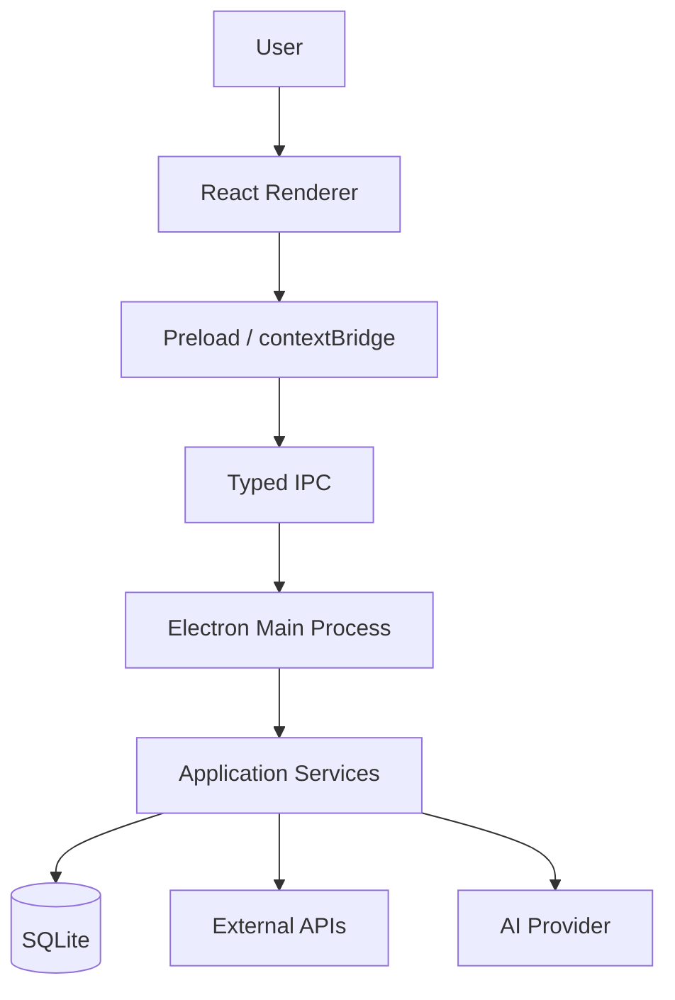

# Architecture

This page provides a technical overview of Calby's system design. It is intended for developers who are contributing to or extending the project.

## High-level diagram



## Renderer responsibilities

The React renderer owns:

- application UI
- routing
- component state
- view models
- visual voice states
- form interaction
- loading/error/success presentation

**The renderer must not**:

- access Node APIs directly
- read/write arbitrary files
- hold long-lived secrets
- own reminder scheduling
- call Electron internals directly
- treat AI responses as completed actions without application confirmation

## Preload responsibilities

Preload is the only bridge between renderer and privileged Electron code.

- Exposes a small typed `window.calby` API.
- Does **not** expose raw `ipcRenderer`.
- Recommended namespaces:

```text
window.calby.voice
window.calby.reminders
window.calby.memory
window.calby.calendar
window.calby.settings
window.calby.system
```

## Main-process services

| Service | Responsibility |
|---|---|
| **AI Service** | Owns Gemini realtime sessions, tool definitions, conversation state, and AI‑originated action requests. Calls Calby services rather than writing storage directly. |
| **Reminder Service** | Owns reminder CRUD, scheduling, snooze, completion, and dismissal. |
| **Memory Service** | Owns explicit memory creation, search, read, update, delete, clear‑all, and enabled/disabled behavior. |
| **Calendar Service** | Owns Google Calendar connection lifecycle and retrieval of upcoming events/event details. |
| **Notification Service** | Owns native notifications, sound, alarms, snooze, dismiss, and alarm duration. |
| **Tray Service** | Owns system tray lifecycle, open, settings, and quit behavior. |
| **Settings Service** | Owns persisted application preferences. |
| **Protected Storage** | Owns local structured application data and protected credentials/tokens. |

## Security boundary

- `contextIsolation: enabled`
- Narrow preload bridge (`window.calby` only)
- Validate all IPC inputs in main
- No raw Electron API in renderer
- No secrets in renderer localStorage
- No secrets in URLs
- No unnecessary personal‑data exposure
- External integrations disconnectable
- Destructive memory deletion requires confirmation

**Current learning project notes**: This project uses a broad toolkit preload API and `sandbox: false`; those choices are not the final Calby security boundary.

## UI shells

Calby uses contextual shells rather than forcing one shell everywhere:

- onboarding shell
- focused voice shell
- main app shell
- settings shell
- native tray/notification surfaces

## Core state flow

### Voice

```text
Idle
  -> Listening
  -> Processing
  -> Responding
  -> Idle
```

### Action

```text
Processing
  -> Tool Request
  -> Action In Progress
  -> Success | Error
  -> Responding
  -> Idle
```

## Failure rule

Never show a successful result merely because Gemini produced a response. The application service must confirm execution first.

## Design integration

Use the frozen Calby Design System and Phase 1–7 references as the UI source of truth. Implementation must reuse:

- typography
- semantic colors
- spacing
- radius
- buttons
- inputs
- cards
- modals
- navigation
- voice states
- reminder states
- notifications
- connection/error patterns

---

[Home](Home) · [Getting Started](Getting-Started.md) · [Quick Voice](Quick-Voice.md) · [How Calby Works](How-Calby-Works.md) · [Integrations](Integrations.md) · [Privacy and Data](Privacy-and-Data.md)